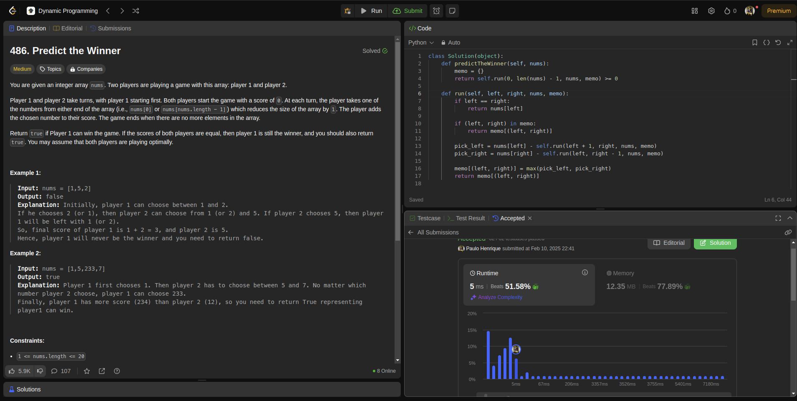

# DP_Leet_Code

Temas:
 - Programação Dinâmica (PD)
 
# DP_Leet_Code

**Número da Lista**: 28<br>
**Conteúdo da Disciplina**: Programação Dinâmica<br>

## Alunos
|Matrícula | Aluno |
| -- | -- |
| 19/0094257  |  Paulo Henrique de O. Rezende |
| 23/2022952  |  Leonardo de Souza Takehana |

## Sobre 
O projeto é contemplado por resolver 4 questões da plataforma LeetCode, sendo 2 dífíceis e 2 médio. A definição de médio, fácil e difícil é concebida pela própria plataforma.

Para os exercícios serem realizados, usamos algoritmos que utilizam o principio da programação dinâmica, como memoization e algoritmo de Bellman-Ford.

## Screenshots
Questão: [Médio - 743. Network Delay Time](https://leetcode.com/problems/network-delay-time/description/?envType=problem-list-v2&envId=53js48ke)


Questão: [Difícil - 42. Trapping Rain Water](https://leetcode.com/problems/trapping-rain-water/description/?envType=problem-list-v2&envId=dynamic-programming)


Questão: [Médio - 486. Predict the Winner](https://leetcode.com/problems/predict-the-winner/submissions/1538712328/?envType=problem-list-v2&envId=dynamic-programming)


Questão: [Difícil - 85. Maximal Rectangle](https://leetcode.com/problems/maximal-rectangle/description/?envType=problem-list-v2&envId=dynamic-programming)


## Instalação 
**Linguagem**: python<br>
**Framework**: Não será preciso<br>
Instalar uma versão lastest stable do python desde de que seja > 3.11.  

## Uso 
Para rodar este projeto, basta entrar na raiz do projeto e executar o arquivo referente a questão que se deseja avaliar, por exemplo:
```
python3 486.PredicttheWinner.py
```

## Outros
Desconsiderar a função </br>main()<br> dos arquivos .py ao tentar submeter ao leetcode. Esta função foi implementada apenas com o intuito de testar casos base.

## Observação
Ao final do vídeo comento que a minha solução MaximalRectangle havia um hashmap(dicionário), mas esatava equivocada por se tratar de uma outro problema que estava tentando resolver em paralelo a gravação.
O problema foi resolvido usando PD de forma iterativa computando o máximo da área do retangulo encontrado dentro do histograma, onde basicamente eu salvo em uma variável o máximo entre o antes e o novo máximo. 

## Vídeo
https://youtu.be/iRnJ3YVUDXk

